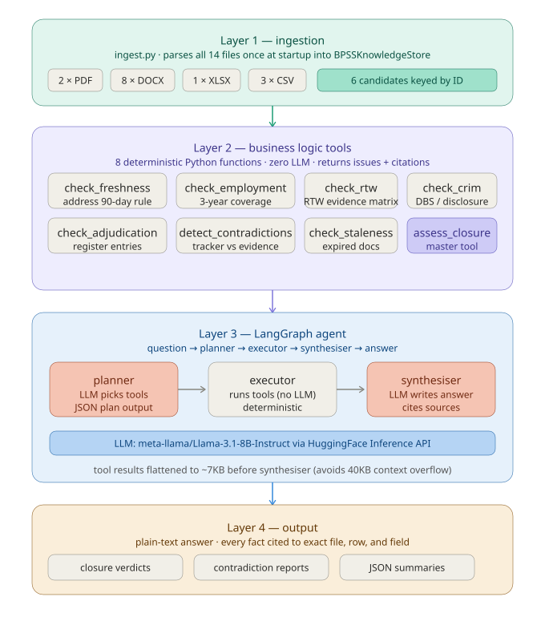

# BPSS Agentic AI Screening System

A backend-only agentic AI system that answers questions over a mixed-format fictional BPSS screening dataset. Built with LangGraph, LangChain, and Llama-3.1-8B-Instruct via HuggingFace Inference API.

---

## Project Structure

```
BPSS_Agent/
│
├── bpss_agentic_dataset/          ← source dataset (not in repo)
│   ├── policies/
│   ├── candidate_pack/
│   ├── evidence/
│   ├── structured/
│   └── reference/
│
├── store/
│   └── models.py                  ← dataclasses (BPSSKnowledgeStore, CandidateRecord, etc.)
│
├── ingestion/
│   └── ingest.py                  ← parses all 14 files into the knowledge store
│
├── tools/
│   ├── __init__.py                ← public API for all tools
│   ├── helpers.py                 ← shared utilities (_cite, _ok, _fail)
│   ├── freshness.py               ← check_freshness
│   ├── employment.py              ← check_employment_coverage
│   ├── rtw.py                     ← check_rtw
│   ├── criminality.py             ← check_criminality
│   ├── adjudication.py            ← check_adjudication
│   ├── contradictions.py          ← detect_contradictions
│   ├── staleness.py               ← check_document_staleness
│   └── closure.py                 ← assess_closure_readiness, get_all_candidates_summary
│
├── agent/
│   ├── __init__.py
│   ├── state.py                   ← AgentState TypedDict
│   ├── nodes.py                   ← planner, executor, synthesiser nodes
│   └── graph.py                   ← LangGraph StateGraph wiring
│
├── tests/
│   ├── test_ingestion.py          ← 35 tests for Phase 1
│   └── test_business_logic.py    ← 39 tests for Phase 2
│
├── run.py                         ← single command entry point
├── inspect_store.py               ← debug/inspection script
├── requirements.txt
├── .env.example
└── README.md
```

---

## Setup

### 1. Clone and create virtual environment

```bash
cd E:\BPSS_Agent
python -m venv .venv
.venv\Scripts\activate        # Windows
# source .venv/bin/activate   # Mac/Linux
```

### 2. Install dependencies

```bash
pip install -r requirements.txt
```

### 3. Configure environment

```bash
copy .env.example .env
```

Open `.env` and add your HuggingFace token:

```
HUGGINGFACEHUB_API_TOKEN=hf_xxxxxxxxxxxxxxxxxxxxxxxx
```

Get a free token at: https://huggingface.co/settings/tokens

> **Note:** `meta-llama/Llama-3.1-8B-Instruct` is a gated model. You must accept the license at https://huggingface.co/meta-llama/Llama-3.1-8B-Instruct before your token will work.

### 4. Verify dataset location

The dataset folder must be at:
```
E:\BPSS_Agent\bpss_agentic_dataset\
```

---

## Run

### Single question

```bash
python run.py "Which candidates are not ready for closure?"
```

### All 10 evaluation questions

```bash
python run.py --all
```

### Inspect the knowledge store (no LLM needed)

```bash
# All candidates summary
python inspect_store.py

# Deep dive on one candidate
python inspect_store.py CAND-104
```

### Run tests

```bash
python -m pytest tests/ -v
# Expected: 74 passed
```

---

## Architecture

The system has four layers:



### Key design decisions

**Ingestion is separate from reasoning.** All 14 files are parsed once at startup into a typed dataclass store. The agent never re-reads files at query time.

**Business logic is deterministic.** Tools like `check_freshness` and `check_employment_coverage` are pure Python functions with no LLM involvement. They compute pass/fail based on policy rules and return structured dicts with source citations. This means results are reproducible and testable.

**The LLM only plans and synthesises.** The planner decides which tools to call based on the question. The synthesiser writes the answer from tool results. Neither touches the raw data directly. This keeps hallucination risk low — the LLM can only cite facts that the tools returned.

**Flattened tool output.** Tool results are converted from nested JSON (40KB+) into a compact readable text format (~7KB) before being sent to the synthesiser. This prevents context window overflow and forces explicit labelling of key values (control completion, risk level, exception type) so the LLM reads rather than infers them.

**Citations are first-class.** Every tool result includes a `citations` list with `source`, `field`, and `value` for every fact used. The synthesiser is instructed to include these in every factual claim.

### PDF table extraction

The adjudication register PDF has overlapping column geometry — adjacent cell characters are physically interleaved in the byte stream. Coordinate-based tools (pdfplumber, Camelot, Tabula) all produce garbled output. pypdf's raw text extraction puts each cell on a separate line in reading order, which is clean and reliable for this PDF. The parser reads exactly 5 lines after each `CAND-NNN` line (decision, approvers, date, scope, notes).

---

## Dataset

6 fictional candidates across mixed file formats:

| Candidate | Role | Verdict | Key Issue |
|---|---|---|---|
| CAND-101 | Analyst | CLEAR | None — all controls complete |
| CAND-102 | Analyst | NOT READY | Stale address proof, DBS pending, employment gap |
| CAND-103 | Intern | CLEAR | Criminality exempt (INTERN role) |
| CAND-104 | Ops | INCORRECTLY MARKED CLEAR | Address proof missing, employment weak, no adjudication entry |
| CAND-105 | Analyst | NOT READY | No address proof, expired BRP, 18-month employment gap, no DBS |
| CAND-106 | Contractor-LTD | NOT READY | RTW dismissed on invalid recruiter assumption |

### Deliberate contradictions embedded

- Tracker marks CAND-104 as Clear but evidence is incomplete and no adjudication entry exists
- CAND-102 `ready_to_join=True` does not equal BPSS closure per SOP
- CAND-106 adjudication entry explicitly has no RTW waiver

---

## Evaluation Questions

All 10 questions from `candidate_pack/sample_questions.md` are answered by running:

```bash
python run.py --all
```

---

## Dependencies

| Package | Purpose |
|---|---|
| `langgraph` | Agent graph orchestration |
| `langchain` | LLM abstractions |
| `langchain-huggingface` | HuggingFace endpoint |
| `pypdf` | PDF text extraction |
| `python-docx` | DOCX parsing |
| `openpyxl` | XLSX parsing |
| `pandas` | CSV parsing |
| `python-dotenv` | Environment variable loading |
| `pytest` | Test runner |